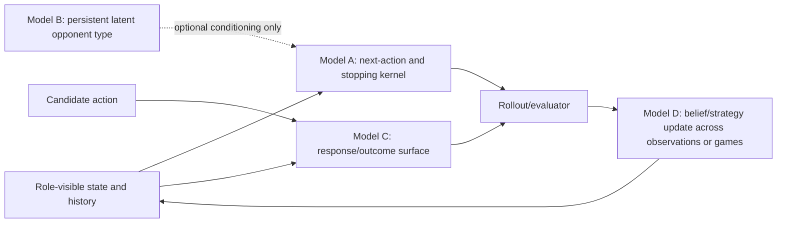

# Wave 5B A/B/C/D architecture and frozen Model-A campaign

Status: **Model A is warranted for a separate development campaign; no Model-A fit was run.**

The bounded necessity audit compares the current schema-v1 operational opponent population with
released acting-model-holdout actions and the terminal-complete live logs already on disk. Its
evidence is candidate/self-audited and deliberately capped below validation. The operational v1
population was fitted on all released rows, so the released comparison is conservative descriptive
misfit, not independent generalization evidence. That limitation makes the observed residuals more,
not less, useful as an architecture alarm; it does not promote a replacement.

## The four models are distinct

| Model | Estimand and interface | Current state | Explicit non-equivalence |
|---|---|---|---|
| A — opponent behavior | `P(next action, offer, exit/stop | role-visible pre-action state, history)`; returns calibrated discrete probabilities, continuous distributions, and a stopping hazard. | Not built. The current evaluator samples static independent parameters and feeds hand-written policies; that is an operational approximation, not a fitted sequential kernel. | A does not claim a persistent latent player identity. |
| B — latent type | A persistent cross-channel/cross-role actor variable that may condition A. | Quarantined. Both empirical joint-bundle formulations failed exact OOF validation; no Model-B artifact may enter this campaign. | Correlated parameter bundles are not next-action prediction. |
| C — response/outcome surface | `P(opponent response/outcome | candidate action, visible state)` for counterfactual candidate actions. | Built, hash-locked, and retained. | C predicts responses to our action; A predicts what the opponent does next, including offers and stopping. |
| D — learning dynamics | How the candidate updates beliefs/policy after observations within/across games. | Not built as an empirical model; current agent uses engineered belief updates. | D changes the candidate's learning, not the opponent data-generating kernel. |

Model A and C may share feature extraction but must expose separate artifacts, targets, scores, and
provenance. Model B remains optional and prohibited by default. Model D consumes only information
available at the declared update time.

## Necessity result and downstream decisions

The preregistered advance rule requires a released defect, the same mechanism/direction in eligible
live evidence or both released roles, and a candidate-reached decision that could change. The audit
clears that rule **for bargaining offer behavior only**. Exact numeric cells live in
`research/EVIDENCE/WAVE5B_MODEL_A_NECESSITY.json`; this document never substitutes rounded prose
for the certificate.

The replicated result is concrete:

- bargaining player-1 central-80% coverage is .642 released and .641 live;
- bargaining player-2 coverage is .464 released and .531 live, with MAE .091 released and .136
  live; and
- these are opponent offers actually observed on Jordan paths, so offer dynamics and stopping can
  change whether the theory anchor's patience is evaluated against realistic movement.

Negotiation and persuasion contain large released diagnostic residuals, but their eligible live
cells are either too small, directionally nonreplicating, or unidentifiable under the frozen text
parser/private-value boundary. They do **not** pass the necessity gate in this wave. A bargaining-
only development campaign is warranted. This is not enough to change a simulator, champion,
research baseline, promotion verdict, or live policy.

## Frozen next Model-A campaign (do not launch automatically)

### Targets and at-risk rows

Stage 1 is bargaining-only. One streaming extractor emits stable, game-clustered rows using only
information visible to the modeled role before the action:

- bargaining, separately by `player_1/player_2`: offer self-share distribution, accept/reject,
  walkaway, and stop/continue hazard;
- trajectory: next-action type and terminal round. Missing callbacks are censored, never relabelled
  as rejection.

Negotiation and persuasion extraction schemas may be specified for interface completeness, but no
model is fitted or selected for them in this campaign. They reopen only after an attributable live
cell replicates a released defect under the same visibility/parser contract.

Forbidden features include terminal payoff/outcome, future transcript, realized hidden quality for
the buyer, hidden counterpart value under incomplete information, opponent identity from the
evaluation fold, response latency after the target, and any field reconstructed from the target.

### Candidate class

Use a **factorized sequential generalized model**, not a latent-type bundle:

1. fixed role-visible feature map with current round, successive own-offer index, horizon status,
   public configuration, information/message regime, prior visible own/counterpart action, and
   bounded history summaries;
2. ridge-logistic/multinomial heads for discrete action and stopping channels;
3. a bounded location/scale distribution for offers, with residual empirical CDF learned only
   inside the training fold;
4. regularized actor and canonical-config effects available only in training; unseen actors/configs
   use the population intercept and public-feature prediction;
5. no cross-channel latent correlation, archetype label, empirical joint bundle, or Model-B draw.

Fixed inner grids: ridge `{0.1, 1, 10, 100}`, history window `{1, 3, 5}`, and offer residual bins
`{32, 64}`. Training-only clustered likelihood chooses the grid, with exact ties preferring larger
ridge, shorter history, and fewer bins. All transformations, clipping atoms, solver/KKT tolerance,
iteration ceiling, memory limit, and feature hashes must be frozen in REGISTRY before code is run.

### Folds and comparators

- outer actor axis: the existing 15 acting models in three deterministic folds of five;
- outer configuration axis: four deterministic folds over canonical public configuration;
- every evaluation row appears once per axis and no held-out actor/config coefficient may be
  serialized or routed;
- comparators: exact operational schema-v1 policy; a training-only role/intercept model; and the
  fixed Model-C response surface on response channels where its estimand matches. Model B is not a
  comparator or dependency.

### Frozen proof endpoints

Every bargaining-role/channel/axis cell is mandatory. Cluster bootstrap uses acting model on the
model axis and canonical configuration on the config axis, with game clustering nested for row
scores.

- discrete: candidate-minus-v1 log loss and Brier mean and 95% upper bound below zero; calibration
  intercept within `±0.10`, slope in `[0.8, 1.2]`, and no ECE regression above `.01`;
- offers: candidate-minus-v1 CRPS mean and 95% upper bound below zero; normalized MAE improves;
  central-80% coverage in `[.75, .85]` and support/nonfinite violations are zero;
- stopping/trajectory: terminal-round MAE and action-count energy both improve with upper CI below
  zero;
- coverage: at least 50% of eligible games, at least 200 rows and 20 clusters per mandatory cell,
  no default/fallback above 5%, and no pooled family result may rescue a failed role;
- policy relevance: report scores separately on the immutable Jordan-reached live branch labels
  from the necessity certificate; these are diagnostics, never training selection.

Any leakage, unavailable channel, failed cell, solver/provenance error, or endpoint regression kills
the exact formulation. No threshold, fold, history window, subgroup, or comparator may change after
outer scoring.

### Independent hostile audit and status ceiling

Before fitting, a fresh owner must reproduce target and feature visibility, actor/config exclusion,
artifact/source hashes, proper-score formulas, clustered inference, coverage, per-role reporting,
and the absence of post-outcome selection. After scoring, a fresh audit must reconstruct the exact
report from frozen row certificates and attack private/future leakage, target reconstruction,
coherent rehashing, subgroup omission and metric switching.

A development pass on this already inspected corpus has maximum status
`candidate_pending_independent_structural_validation`. It cannot supply the simulator, promotion
gate, factorial baseline, or live policy. Promotion later requires the exact structural-holdout
pass, the independent audit, and a prospectively untouched confirmation source.

### Resource budget and completion condition

- expected: 3–6 CPU-hours, peak 8 GiB RAM, less than 2 GiB total artifacts;
- hard stop: 8 CPU-hours, 12 GiB RSS, 3 GiB artifacts, or any single fold over 90 minutes;
- bounded processes: one fold per process, atomic fold certificates, no seven-artifact in-memory
  aggregation;
- completion: all seven fold artifacts frozen and hash-verified, both OOF axes scored exactly once,
  independent hostile audit complete, and a pass/fail certificate committed. Exceeding a resource
  limit is a failed formulation, not permission to relax it.

Wave 5B stops at this contract. It does not begin the fit.

## Research reconnection policy

Recommendation: **preserve the current theory + Model-C four-arm study**. A future validated
Model A first becomes competition/evaluator infrastructure. Its interfaces should be reusable by
a second-generation four-arm robustness study, where all four arms are rebuilt on the same A+C
core.

Because no factorial outcomes exist, the user retains one exceptional choice point after Model A
passes full independent validation: explicitly delay and refreeze all four arms around A+C. That
would invalidate current baseline hashes, parity evidence, manifests and production pins and
would require the relevant Waves 1–5 checks again. Wave 5B does not make that choice.
