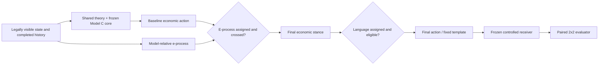

# Wave 5C collaborator architecture and terminal status

Status: **cross-branch terminal handoff; no branch merge.** This document indexes the three
independent Wave 5C branches at their pushed terminal commits. It does not import Route L or
Route A code into Route P, authorize an external receiver, set a production pin, validate Model
A, alter Jordan, run a treatment-payoff study, or authorize a live/rated game.

## Terminal route map

| Route | Branch and terminal commit | Terminal scientific status |
| --- | --- | --- |
| P | `research/wave5c-paper` @ `68b76ad8c438291d511e24a9b45ab3ace5c43a16` | Concrete hosted-receiver proposal and provider-neutral dry-run infrastructure; offline-only and not capability-verified. |
| L | `research/wave5c-telemetry` @ `f2a1bb5afe6f83c3a8a03201a0e5939f748ecda9` | Jordan readiness state 2: technically ready for one separately authorized bounded canary; zero games played. |
| A | `research/wave5c-model-a` @ `c9c2c030606e1eca4676e6f9f7b0ed4561f52592` | Independent pre-fit audit failed with eight fatal objections; campaign stopped before corpus extraction or fitting. |

All three local branches were clean and exactly equal to their upstreams when this handoff was
written. Wave 5C made no cross-route merge.

## Four forced research agents

The four agents remain four treatment assignments around one shared theory-plus-Model-C economic
core, not four separately optimized policies:

| Agent | E-process | Language | Composition |
| --- | --- | --- | --- |
| `Factorial00Agent` | off | off | shared treatment-off economic baseline |
| `Factorial10Agent` | on | off | baseline, then e-process treatment |
| `Factorial01Agent` | off | on | baseline, then language rendering |
| `Factorial11Agent` | on | on | baseline, then e-process, then language rendering |

The order is immutable: `economic core -> e-process -> language`. In arm 11, language renders the
post-e-process economic stance. Language may not independently change the numeric action or
economic decision.

## Models A, B, C, and D

- **Model A** is a learned model of an opponent's actual sequential action and stopping process.
  Wave 5B established candidate/self-audited evidence that such a model is needed for bargaining.
  Wave 5C produced candidate code, but its independent pre-fit audit failed. It therefore supplied
  no fitted model, prediction evidence, structural validation, untouched confirmation, or payoff
  evidence. Reopening requires a new formulation, new code and contract hashes, and a fresh
  independent hostile pre-fit audit.
- **Model B** is a persistent latent-type/joint-opponent model. The exact mixed-fold formulation
  failed its out-of-fold validation and is quarantined. Model B is absent from the shared economic
  core, evaluator, e-process, controlled-receiver route, Jordan canary, and all Wave 5C evidence.
- **Model C** is the frozen response/outcome surface. The shared research core uses the hash-locked
  artifact only where its response estimand and support contract match. Its frozen SHA-256 is
  `9daec869b3e4950945a1a370486e8841874fe9f5e611a7e8638dcdaa2b08b82c`.
  It is a fitted point reference, not an established one-sided conditional bound for real
  opponents.
- **Model D** is learning dynamics: how beliefs or strategy update across observations or games.
  It remains an engineered treatment/controller interface, not an empirically validated opponent
  learning model. It must remain versioned separately from A, B, and C.

## Exact e-process contract

The only supported process is a **model-relative e-process against a fixed hash-locked Model-C
reference** for completed prior persuasion rounds when the candidate is the seller. Let `X_t=1`
when the buyer follows the seller's recommendation. Model C supplies predictable `p_{0,t}`; define

\[
q_t=p_{0,t}+0.5(1-p_{0,t}),\qquad
M_t=\left(\frac{q_t}{p_{0,t}}\right)^{X_t}
    \left(\frac{1-q_t}{1-p_{0,t}}\right)^{1-X_t},\qquad
E_t=\prod_{s\le t}M_s.
\]

Under the stated conditional null
`P(X_t=1 | F_{t-1}) <= p_{0,t}`, `E_t` is a nonnegative supermartingale. The first-crossing
threshold is `E_t >= 20`, so Ville's inequality gives a within-process bound of `1/20 = 0.05`
under that null. After a crossing, the acting treatment can change a supported baseline seller
recommendation from `no` to `yes`.

This does **not** establish that Model C upper-bounds real-opponent obedience, a population-wide
type-I guarantee, multiplicity control across games, or validity for bargaining, negotiation,
persuasion-buyer, or continuous offers. Economic usefulness has not been payoff-tested.

## Language mechanism and controlled receiver

Language is a fixed persuasion-seller rendering intervention. It chooses between two frozen text
templates for the final `yes` stance or two for the final `no` stance, after the economic action is
complete. Unsupported families, roles, and message modes are exact negative controls.

The existing offline rule-based receiver ignores wording, so it cannot identify a language
effect. Route P prospectively recommends hosted `openai/gpt-4.1-2025-04-14` as primary and hosted
`openai/gpt-4.1-mini-2025-04-14` as a nonautomatic fallback, with Design A because hosted outputs
are not assumed byte-deterministic. The full 13-field contract, prompt bytes, strict parser,
hidden-input boundary, retry/missingness rules, cache, capability probes, and resource ceilings
are frozen in Route P. Neither model was called or capability-certified, and both production pins
remain unset.

Design A has 3,600 paired scenario units: 1,200 per family. Reuse across four arms yields 14,400
agent episodes. Only 600 persuasion-seller rows are receiver-eligible; 20 rounds and four arms
yield 48,000 nominal confirmatory requests. Including one reserved retry and the 100-request
capability stage yields 48,100 nominal requests and a 96,200-attempt hard ceiling.

## Data-feedback loop

Evidence moves through immutable, separately versioned layers:

1. append-only raw capture with per-record identity and byte hashes;
2. a launch/run manifest that freezes code, agent, artifacts, dependencies, platform and caps;
3. a content-addressed normalized snapshot with parser and exclusion provenance;
4. a fit artifact bound to training snapshots, folds, features, solver and training-only metrics;
5. an evaluation certificate bound to untouched rows, proper scores, inference seeds and the
   prospective pass/fail contract.

Canary data may diagnose or nominate a later version but may not tune and confirm the same
version. Receiver-capability data, factorial outcomes, simulator data and competition live data
remain in separate namespaces. Rollback restores the entire deployment tuple, not only the agent
class.

Route L now implements attributable future live capture for Jordan without changing its policy.
It independently binds Jordan commit `bce578597dbfacf2ebca38399edb41a5dde2f936`, telemetry code,
dirty-tree digest, platform identity, optional artifacts, non-secret environment hashes, batch and
game records, hash-chain, terminal reconciliation, and explicit official-score capability. Its
read-only `/stats` check verified identity and `active_games=0`; no game was queued.

## Evaluation status

- No row of the 3,600-unit factorial payoff study has run.
- No hosted receiver capability request has run.
- Both receiver/report production pins remain `None`.
- Model A stopped before extraction, fit, OOF scoring, structural holdout, policy diagnostics, or
  payoff evaluation.
- Model B remains quarantined and unused.
- Jordan is readiness state 2 only: attributable canary infrastructure is ready, but no live/rated
  game has run and official per-game scoring remains unobserved.
- Synthetic/unit evidence verifies infrastructure and fail-closed behavior; it is not treatment,
  receiver, prediction, payoff, or leaderboard evidence.

## Paper claims

Permitted now:

- the four forced entrypoints exist and share one frozen economic core;
- treatment override attempts fail and composition order is economic, e-process, language;
- the e-process algebra is valid under its explicitly stated predictable Model-C-relative null;
- language changes only eligible rendering and is inert in unsupported cells;
- exact provider-neutral receiver, manifest, evaluator, and telemetry infrastructure has passed
  the reported offline tests and hostile audits at the cited commits;
- Model B is quarantined and absent; Model A's first Wave 5C candidate failed before fitting;
- all production paths remain fail-closed without their separate authorizations.

Prohibited now:

- either treatment or their interaction changes or improves payoff;
- either proposed hosted receiver is responsive, deterministic, available to this account, or
  scientifically valid;
- the e-process is population-valid or Model C is a real-opponent conditional upper bound;
- Model A predicts better, passed structural validation, improves policy payoff, or can be
  integrated;
- Model B supports any current route;
- any research arm or Jordan has established top-five, winning, or improved leaderboard
  performance;
- synthetic or dry-run tests constitute causal, predictive, payoff, or live evidence.

## Recommended authorization order

1. **Receiver selection and capability only.** Prospectively select primary or fallback, record
   the treatment-blind selector and time, provide credentials and reviewed adapter/dependency
   hashes, accept cache/retention, and authorize only the bounded capability spend. Do not pin or
   run the payoff study.
2. **Jordan bounded canary.** Separately authorize exactly one 300-game-maximum canary using the
   frozen Route-L tuple and stop rules. This is operationally independent of the paper study.
3. **Factorial payoff freeze and run, only conditionally.** Only after an untouched passing
   receiver capability certificate and fresh hostile audit, decide whether to set the production
   hashes and authorize the exact Design-A 3,600-unit study.

The failed Model-A candidate is not on this authorization ladder. Reopening it is a new research
formulation, not permission to repair or rerun the rejected contract.

