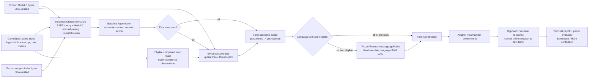

# Technical handoff: frozen 2x2 e-process x language study

Status: researcher-facing handoff, frozen before treatment-payoff evaluation. The economic and
treatment architecture is source-bound to repository commit
`3a04ec199a725957b06df75bc6eabd50e60a6574` on branch
`research/2x2-eprocess-language`, plus the exact external artifact hashes listed below. Wave 5A
adds offline-only receiver and pre-outcome-manifest infrastructure; its exact implementation
commit and file hashes are recorded in
`research/EVIDENCE/WAVE5A_OFFLINE_PREFLIGHT_CHECKPOINT.json`. No Wave 5A artifact activates a
receiver, production manifest, treatment outcome, or authorization pin.

## 1. Research question and four forced arms

The question is whether adding (1) an acting e-process and/or (2) a fixed language rendering
intervention to the same theory-plus-empirical-residual economic agent changes normalized payoff.
The design is factorial:

| Entrypoint | E-process | Language | Meaning |
| --- | --- | --- | --- |
| `Factorial00Agent` | off | off | shared treatment-off baseline |
| `Factorial10Agent` | on | off | baseline plus e-process |
| `Factorial01Agent` | off | on | baseline plus language |
| `Factorial11Agent` | on | on | baseline plus e-process, then language |

These are four forced entrypoints built by composing two interventions with one shared economic
core. They are not four independently optimized economic agents. The exact entrypoints are in
`research/CANDIDATES/wave3_factorial_agents.py`, in `FACTORIAL_AGENTS` under keys `e0_l0`,
`e1_l0`, `e0_l1`, and `e1_l1`. Each constructor rejects caller-supplied `use_eprocess` or
`use_language`; an `ArmContext` whose flags disagree with the entrypoint also fails. The source
tests exercise both rejection paths.

The primary outcome contract and contrasts are frozen in `research/RESEARCH_QUESTION.md` and
`research/ROUTES/WAVE4_ESTIMANDS.md`. For paired scenario payoff `Y(e,l)`:

\[
\begin{aligned}
\Delta_E &= \tfrac12\{[Y(1,0)-Y(0,0)]+[Y(1,1)-Y(0,1)]\},\\
\Delta_L &= \tfrac12\{[Y(0,1)-Y(0,0)]+[Y(1,1)-Y(1,0)]\},\\
\Delta_I &= Y(1,1)-Y(1,0)-Y(0,1)+Y(0,0).
\end{aligned}
\]

No row of the intended 3,600-row treatment study has been run.

## 2. Architecture and execution order



The implemented composition order in `Wave3FactorialAgent.decide` is exactly:

```text
economic core -> e-process treatment -> language treatment
```

This order matters in arm 11: if the e-process changes a baseline recommendation from `no` to
`yes`, the language policy sees `yes` and selects one of the two `yes` templates. It therefore
verbalizes the post-e-process recommendation, not the superseded baseline recommendation.

### Randomness isolation

`glee_eval/experiments/factorial.py` derives six logical streams from a master seed and scenario
identity:

1. scenario/configuration selection;
2. environment/nature;
3. opponent policy (the receiver stream in the current offline environment);
4. candidate economic policy;
5. candidate e-process;
6. candidate language.

The three candidate streams are issued as capability objects. `TreatmentOffEconomicCore` receives
the economic seed; `EProcessController` can receive only the `eprocess_treatment/eprocess`
capability; `FrozenPersuasionLanguagePolicy` can receive only the
`language_treatment/language` capability. The evaluator checks exact object bindings, enabled
claims, draw counts/trace hashes, and arm-invariant scenario, environment, opponent, nature,
support, eligibility, artifact, and economic-stream identities.

Paired causal comparisons require each arm to face the same pre-treatment state and exogenous
random draws. If a language arm consumes the economic stream, later economic choices can differ
even when text has no causal effect. If any arm advances the environment or receiver stream,
nature or opponent behavior can differ solely because of treatment assignment. Either defect
breaks exchangeability of the paired rows and can manufacture a treatment contrast; it is not
repaired by reusing one integer seed.

## 3. Shared baseline: what it is and is not

The baseline is `TreatmentOffEconomicCore`, not the toy `my_agents/baseline.py` agent. It subclasses
`my_agents.jordan_strategic.JordanStrategicAgent` but freezes its control and removes treatment-like
adaptation. Its study entrypoints require both frozen artifacts; the core itself can be constructed
without artifacts only for bounded parity/unit tests.

### Retained economic architecture

Source inspection of `TreatmentOffEconomicCore` and its parent verifies that the core retains:

- bargaining beliefs and alternating-offers theory through `bargaining_spe_shares` and
  `bargaining_accept_floor`, including role-specific discount factors, SPE share, continuation
  accept floor, fairness anchor, last-offer accounting, and legal offer/decision construction;
- negotiation beliefs, role-oriented surplus and reservation-value logic, offer/acceptance
  screening, outside-option handling, price scaling, and an agent-supplied counter-price on a
  rejection so the adapter does not invent an economic fallback;
- persuasion Bayesian beliefs over quality and seller behavior, value/break-even purchase logic,
  seller recommendation logic, and the fixed required baseline messages;
- hash-verified Model-C response-residual routing for supported, non-global offer/recommendation
  buckets;
- hash-verified `CoverageGate` context/action support review; and
- `AgentAction` construction with role, round, typed numeric/accept/buy fields, structured audit
  metadata, compact IDs, and adapter-safe negotiation fields.

The relevant class chain is:

```text
my_agents/jordan_strategic.py:JordanStrategicAgent
  -> research/CANDIDATES/r1_treatment_off_baseline.py:TreatmentOffEconomicCore
  -> research/CANDIDATES/wave3_factorial_agents.py:Wave3FactorialAgent
  -> Factorial00Agent / Factorial10Agent / Factorial01Agent / Factorial11Agent
```

### Removed or frozen behavior

The core:

- returns `{}` from `_bargaining_evidence`, `_negotiation_evidence`, and
  `_persuasion_evidence`; historical heuristic `E_*` fields cannot control it;
- replaces adaptive EXPLORE/EXPLOIT/COMMIT selection with one `StrategicControl` in `SAFE` mode,
  submode `treatment_off_economic_core`;
- sets `message_mode="off"`, bypasses the persuasion message composer, and deletes
  `message_composer`; it retains only messages required to render the economic action;
- disables persuasion exploration, Platt adjustment, deceptive-seller guard, text-stance
  parsing, time concession, margin guarantee, counterpart-value debiasing, and unknown-horizon
  experimental paths;
- prevents the parent from consulting ambient `GLEE_RESPONSE_MODEL` or `GLEE_SUPPORT_INDEX`
  paths; and
- accepts external Model-C/support state only with declared 64-character SHA-256 values and
  validates the JSON surfaces before use.

For the factorial study, `Wave3FactorialAgent.__init__` fails unless both artifact hashes are
present. Every arm exposes one identical artifact provenance manifest; the evaluator rejects an
arm whose artifact bytes differ.

### Source and artifact provenance

| Item | Path / commit | SHA-256 at `3a04ec1` |
| --- | --- | --- |
| Current research commit | `3a04ec199a725957b06df75bc6eabd50e60a6574` | Git object ID shown |
| Baseline introduced/frozen | commit `895ffee341cd4893373e32d5f8c1a5375549e0e6`; amended in Wave 4 checkpoint `a715b2a3e651db2a0f573f7f4940337ccfe62004` | — |
| `TreatmentOffEconomicCore` | `research/CANDIDATES/r1_treatment_off_baseline.py` | `5e6e5daebef9df16c06ce2c4bdc3a3378b30241a4b23b08310f9447c051998a9` |
| Parent economic architecture | `my_agents/jordan_strategic.py` | `27526fc4801a856cbf0db4690a336f1f375a98fbe52256c3672935a3ea24fc82` |
| Four real agents introduced | commit `a1438d0878dd89fff7d71accc7ddc7faebac983b`; amended in `a715b2a…` | — |
| Four agents and treatments | `research/CANDIDATES/wave3_factorial_agents.py` | `f5b34b42c759391a0f68d188ce71e51cbc43a33e128dd73fcecbfebd8e6a8265` |
| Factorial evaluator | `glee_eval/experiments/factorial.py` | `c272d602cafced4c93be00b43d4d7df7174229a543eda6ee08ec59dd95c4aee1` |
| Report verifier | `glee_eval/experiments/factorial_report.py` | `23cdbe690170b1d7eb598590e43e9bd7833d013019903b6acda7899e3455f270` |
| Model C | `/Users/sahararora/Glee-Compeition/models/response_v1/model.json` | `9daec869b3e4950945a1a370486e8841874fe9f5e611a7e8638dcdaa2b08b82c` |
| Support index | `/Users/sahararora/Glee-Compeition/reports/dataset_audit/support_index.json` | `b958776534e764ed14099f4194af5437d4b9f8d6e5be3ec6537276eb133d9145` |
| Non-Model-B holdout opponent population, frozen for a future authorized study | `/Users/sahararora/Glee-Compeition/models/opponent_population_holdout/opponent_population.json` | `3371131752a83dde73adba341aec78aab14af9bfd02b94b0bf7b773c317e051d` |
| Config catalogue, frozen for a future authorized study | `/Users/sahararora/Glee-Compeition/models/config_catalogue_holdout/config_catalogue.json` | `2a32c01dd02f08663c54b9f149c7fc8eda9e0d3b4ade59a0d463c0c55b67e2ae` |

The frozen baseline manifest is `research/EVIDENCE/WAVE4_BASELINE_CONTRACT.json`; its canonical
artifact-provenance payload hash is
`620e0b10bf0d39bfae113348485702ebf95c5def24d06de19d2f7d097d61538e`.

Model B is absent from every path above.

## 4. E-process treatment: exact contract

### Intuition and variables

The only implemented stream is a persuasion game in which the candidate is the seller. At an
eligible completed prior-round opportunity, `X_t=1` when the buyer follows the seller's prior
recommendation: buy after `yes`, or decline after `no`. Model C supplies a predictable, fixed
reference buy probability from the historical state. The controller turns it into a follow
probability:

- for recommendation `yes`, `p_{0,t}` is Model C's buy probability;
- for recommendation `no`, `p_{0,t}` is one minus Model C's buy probability.

Let

\[
q_t=p_{0,t}+0.5(1-p_{0,t}),
\]

and define the one-step factor

\[
M_t=
\left(\frac{q_t}{p_{0,t}}\right)^{X_t}
\left(\frac{1-q_t}{1-p_{0,t}}\right)^{1-X_t}.
\]

The running e-value is

\[
E_t=\prod_{s\le t}M_s, \qquad E_0=1,
\]

with first-crossing threshold `E_t >= 20`.

The exact conditional null is

\[
\Pr(X_t=1\mid\mathcal F_{t-1})\le p_{0,t}.
\]

Here `p_{0,t}` and `q_t` must be predictable from the fixed artifact and legally visible
pre-outcome history. If the actual conditional follow probability is `r_t <= p_{0,t}`, then

\[
\mathbb E[M_t\mid\mathcal F_{t-1}]
=r_t\frac{q_t}{p_{0,t}}+(1-r_t)\frac{1-q_t}{1-p_{0,t}}\le 1.
\]

The expression is affine and increasing in `r_t` because `q_t >= p_{0,t}`, and equals one at
`r_t=p_{0,t}`. Therefore `E_t` is a nonnegative supermartingale under the stated null. Ville's
inequality then gives

\[
\Pr\!\left(\sup_t E_t\ge20\right)\le\frac1{20}=0.05
\]

for that one within-game stream.

### Implemented update and acting behavior

`EProcessController.update_from_state`:

1. resets `evalue`, processed event IDs, trace, status, and first-crossing record when `game_id`
   changes;
2. reconstructs completed seller and buyer events by round from the visible transcript;
3. ignores the current and all future rounds;
4. constructs the historical Model-C state without the buyer outcome being scored;
5. uses stable event IDs so repeated callbacks are idempotent;
6. appends a full `EProcessUpdate` trace and stores the first crossing; and
7. exposes reset, status, null, alternative, threshold, e-value, trace, crossing, and unsupported
   scopes in the action metadata.

Once a crossing exists, `_apply_eprocess` changes a supported persuasion-seller baseline
recommendation from `no` to `yes` and records
`economic_override="recommend_yes_after_crossing"`. In every other case it records state and
leaves the economic recommendation unchanged. The process resets per game, not on a strategy
mode change.

### Eligibility and limits

An update is admitted only when all of the following hold:

- family is `persuasion` and candidate role is `seller`;
- both a valid seller `yes/no` recommendation and buyer `yes/no` decision exist in a completed
  prior round;
- the exact hash-locked Model-C object is present;
- the estimate is not a global fallback;
- bucket support is at least the artifact's `min_support`;
- `support_quality >= 0.5`; and
- the reference probability is in `[0.01, 0.99]`.

The formal channel explicitly excludes bargaining, negotiation, persuasion-buyer, continuous
offer/concession evidence, and historical heuristic `E_*` values. Bargaining and negotiation
acceptances terminate the episode before another candidate callback, so a callback-only stream
would observe a rejection-selected sample. A persuasion buyer would be monitoring its own action.
No accepted continuous conditional density/e-factor exists for offers.

### Three different validity questions

| Question | Supported answer |
| --- | --- |
| Is the process mathematically valid under its stated conditional null? | **Yes.** The factor has conditional expectation at most one if `P(X_t=1 | F_{t-1}) <= p_{0,t}` and the reference is predictable. |
| Does Model C provide a valid conditional upper bound for real opponents? | **Not established.** Model C is a fitted point reference. Predictive accuracy does not establish the required one-sided, history-conditional bound. |
| Is crossing and changing `no` to `yes` economically useful? | **Unknown.** It has never been payoff-tested. |

The exact surviving label is:

> model-relative e-process against a fixed hash-locked Model-C reference

The attempted distribution-free population extension was killed: with arbitrary dependence, a
finite training prefix is compatible with next-step conditional follow probability one, making
one the only uniform bound and making the proposed likelihood ratio uninformative. Selection
across the 596 eligible Model-C buckets and multiplicity across games are unresolved. No
population-wide type-I guarantee, all-family guarantee, or real-opponent conditional-bound claim
may be made.

## 5. Language treatment

`FrozenPersuasionLanguagePolicy` is eligible only when the candidate is the persuasion seller,
`seller_message_type == "text"`, and the completed economic action has a `yes` or `no` stance.
It uses only its language capability to choose between two fixed templates for that stance:

| Stance | Mechanism | Template ID | Exact text |
| --- | --- | --- | --- |
| `yes` | confident | `yes_confident_v1` | `I am confident this product is worth buying.` |
| `yes` | social proof | `yes_social_proof_v1` | `Buyers often value products like this; I recommend buying.` |
| `no` | counter-interest credibility | `no_counter_interest_v1` | `Even though I benefit from a sale, I recommend passing on this product.` |
| `no` | neutral control | `no_neutral_v1` | `My recommendation is to pass on this product.` |

It replaces only `raw_text`, `message`, and `structured.message`, then records its schema,
mechanism, and template ID. It cannot independently change a numeric offer, accept/reject field,
buy/recommendation stance, support mask, environment state, or economic decision. Unsupported
family/role/message-mode cells return the same action object; tests compare serialized control
and language-arm actions byte-for-byte in those cells. In arm 11, the selected stance is the
post-e-process stance.

### Current environment obstruction

The frozen receiver contract is:

```json
{
  "schema": "glee.research.receiver_capability.v1",
  "environment_id": "glee.offline.rule_based_text_blind.v1",
  "candidate_text_delivered": true,
  "receiver_consumes_candidate_text": false
}
```

Candidate text reaches the structured payload, but `BargainingPolicy` and `NegotiationPolicy`
read numeric offers/values and `PersuasionPolicy` reads `buy_no_buy` or
`structured.decision`; none reads candidate wording. The terminal payoff functions use numeric
actions, structured decisions, qualities, and values, not message words. A bounded text-only
perturbation test holds all nontext state and the opponent seed fixed and observes `0/3` receiver
action divergences across bargaining, negotiation, and persuasion.

Thus the current offline environment cannot identify a candidate-language payoff effect. A zero
language contrast there is zero by construction, not evidence that language is ineffective. A
numeric language or interaction estimand is nonreportable until a prospectively selected,
frozen, text-responsive receiver contract passes an independent capability test.

### Wave 5A offline preflight (not a selected receiver)

`glee_eval/experiments/controlled_receiver.py` now supplies a provider-neutral contract and an
injected-transport harness. The contract freezes receiver identity or local artifact bytes,
exact prompt bytes, visible/hidden fields, distinct economic-stance and candidate-text fields,
decoding/seeds, a strict parser schema, retry/timeout/refusal/missingness behavior, request and
response hashes, exact cache replay, resource caps, eligibility, and treatment-blind selection.
Generic probes explicitly reject the four treatment templates. A passing mock certificate is
labelled `infrastructure_only_non_evidence`; the repository supports no named receiver choice.

`glee_eval/experiments/preoutcome_manifest.py` now binds exact scenario/configuration bytes and
within-family scenario indices, reconstructible scenario/environment/opponent and treatment RNG
streams, Model-C payload, support masks, receiver/artifact/dependency hashes, entrypoints,
policies, estimands, missingness, and report schema. Synthetic fixtures remain non-evidence.
Production validation requires two independent authorization pins, both intentionally `None`.
The exact 3,600-row factorization remains unselected; three defensible breadth-versus-receiver-
replication designs and the required user decision are in
`research/ROUTES/WAVE5A_MANIFEST_DESIGNS.md`.

## 6. Implementation and evidence ledger

Evidence classes are deliberately separated. Unit tests and synthetic canaries verify code and
failure behavior; they do not estimate a treatment effect.

| State / evidence class | Item | What is established | What is not established |
| --- | --- | --- | --- |
| Implemented and frozen | `TreatmentOffEconomicCore` | one SAFE treatment-off economic core, verified artifact loading, theory/residual/support path | payoff quality or treatment benefit |
| Implemented and frozen | four forced entrypoints | correct 00/10/01/11 mapping; flag overrides fail | superiority of any arm |
| Implemented and frozen | `EProcessController` | supported persuasion-seller trace, reset, threshold, and acting override | real-population bound; payoff benefit; across-game multiplicity |
| Implemented and frozen | language policy | four exact templates and language-only action rendering | receiver responsiveness or language payoff effect |
| Implemented and frozen | RNG capabilities | named scenario/environment/opponent/economic/e-process/language streams and candidate capability bindings | protection against malicious unaudited module-global randomness |
| Implemented and frozen | evaluator/report verifier | four-way pairing, immutable identity/provenance checks, contrasts, eligibility reconstruction, Holm report, production/synthetic schema split | an authorized production contract or completed study |
| Unit/parity tested | baseline parity | 10 family/role/action cells plus 8 adapter fixtures; hostile `E_*` cannot change action bytes; no adapter fallback | economic performance |
| Unit/parity tested | treatment behavior | override rejection; supported/inert cells; language cannot change economic fields; arm-11 composition; e-process idempotence/reset/no-future-read; hash failures | causal outcome effects |
| Unit/parity tested | byte and RNG canaries | unsupported language cells byte-identical; economic RNG trace and non-treatment projections reject contamination | receiver causal response |
| Unit/parity tested | artifact failures | missing hashes, mismatched bytes, absent required artifacts, and an arm with changed artifact bytes fail | correctness of the substantive fitted probabilities |
| Independently audited | Wave 4 R4 obstruction | 40/40 targeted agent/evaluator/report canaries; hostile eligibility, RNG, opponent/nature, role, row-contract, and authorization mutations rejected or synthetic-only | production readiness while authorization pin is `None` |
| Independently audited | Wave 5A pre-outcome checkpoint | fresh hostile context rejects fixed-contract scenario, receiver, RNG, support, Model-C, policy, schema, output, dependency, order, and exclusion mutations | production activation while receiver/design decisions and both pins remain unresolved |
| Implemented but never payoff-evaluated | both treatments and their interaction | executable treatment capability exists | `Delta_E`, `Delta_L`, or `Delta_I` sign/magnitude |
| Implemented offline, not activated | generic controlled-receiver contract/cache/replay/capability harness | exact infrastructure and synthetic failure behavior | chosen receiver, external capability result, language effect |
| Implemented offline, design pending | pre-outcome manifest builder/validator and candidate 3,600-row factorizations | fixed-contract reconstruction and fail-closed synthetic/production separation | selected factorization, exact row root, production authorization, outcomes |
| Blocked pending user selection | language receiver environment | current text-blind limitation is verifier-backed | provider/model/version or local artifact, prompts, decoding, costs, and authorization |
| Failed/killed | current Model-B formulations | exact mixed-fold formulation failed; actor-factor continuation is not authorized | that Model B can never be useful in another study |
| Failed/killed | population-valid e-process extension | distribution-free nontrivial conditional upper bound cannot be obtained from the finite training prefix | validity under the explicitly assumed model-relative null |
| Failed/killed | current offline language-effect route | receiver is text-blind, so it cannot identify wording effects | language effectiveness in a text-responsive population |
| Explicitly unauthorized | production/outcome activity | none was performed | 3,600-row study, holdout treatment-effect study, external calls, live/rated games, large learned receiver, template optimization, Model-B run |

### Model B quarantine

> R0/Model B is quarantined after failed exact out-of-fold validation. It is not an authorized
> dependency of the current baseline, e-process, evaluator, receiver, or competition promotion
> gate. Its artifacts and failed routes are preserved for provenance.

The frozen failed report SHA-256 is
`1a86cac280b1cd6b0049bc9429a6662f9d33b754dcfb23b4044e5b04ebbdacec`.
The interrupted actor-factor fit wrote no fold artifact or checkpoint and must not be resumed.

> Reopen Model B only through a new, explicitly authorized campaign with a new falsifiable
> formulation, prespecified untouched validation, a strict resource budget, and a clear
> explanation of what downstream decision would change if it passed. Do not simply resume the
> interrupted actor-factor fit.

Possible future uses include a separate leaderboard-agent improvement, a better offline opponent
simulator, a robustness analysis or second factorial study, or actor-heterogeneity research.
Those are possibilities, not current dependencies and not evidence for the present study.

### Current and historical verification

The following bounded, non-payoff command was rerun from `3a04ec1` on 2026-08-16:

```sh
env -u GLEE_RESPONSE_MODEL -u GLEE_SUPPORT_INDEX PYTHONDONTWRITEBYTECODE=1 \
  python3 -m unittest -v \
  tests.test_r1_treatment_off_baseline \
  tests.test_r2_population_bound_kill_check \
  tests.test_r3_language_feasibility
```

Current result: `11` tests passed (`8` baseline/parity, `2` population-bound kill checks, `1`
text-blind receiver test), `0` failed; unittest-reported runtime `0.018s`.

The following direct-agent subset was also rerun. It deliberately excludes the two methods that
launch synthetic factorial episodes, in order to keep this worker's verification non-payoff:

```sh
PYTHONDONTWRITEBYTECODE=1 python3 -m unittest -v \
  tests.test_wave3_factorial_agents.Wave3FactorialAgentTests.test_four_forced_entrypoints_reject_flag_overrides \
  tests.test_wave3_factorial_agents.Wave3FactorialAgentTests.test_all_four_arms_require_both_frozen_artifacts \
  tests.test_wave3_factorial_agents.Wave3FactorialAgentTests.test_all_four_are_callable_in_every_family_role_action_cell \
  tests.test_wave3_factorial_agents.Wave3FactorialAgentTests.test_language_never_changes_numeric_or_economic_decision \
  tests.test_wave3_factorial_agents.Wave3FactorialAgentTests.test_eligible_language_differs_and_unsupported_cells_are_exactly_inert \
  tests.test_wave3_factorial_agents.Wave3FactorialAgentTests.test_eprocess_does_not_change_rendering_before_an_economic_change \
  tests.test_wave3_factorial_agents.Wave3FactorialAgentTests.test_eprocess_accumulates_real_idempotent_state_and_resets \
  tests.test_wave3_factorial_agents.Wave3FactorialAgentTests.test_11_contains_both_treatments_without_rng_or_state_aliasing \
  tests.test_wave3_factorial_agents.Wave3FactorialAgentTests.test_threshold_crossing_changes_only_supported_economic_scope \
  tests.test_wave3_factorial_agents.Wave3FactorialAgentTests.test_exact_null_enumeration_respects_ville_bound \
  tests.test_wave3_factorial_agents.Wave3FactorialAgentTests.test_eprocess_never_reads_current_or_future_round_outcomes \
  tests.test_wave3_factorial_agents.Wave3FactorialAgentTests.test_controller_explicitly_rejects_unsupported_acting_scopes
```

Current result: `12` tests passed, `0` failed; unittest-reported runtime `0.046s`.

The integrated Wave 5A non-payoff regression command is:

```sh
env -u GLEE_RESPONSE_MODEL -u GLEE_SUPPORT_INDEX \
  PYTHONPYCACHEPREFIX=/private/tmp/glee_wave5a_pycache \
  python3 -m unittest \
  tests.test_r1_treatment_off_baseline \
  tests.test_wave3_factorial_agents \
  tests.test_r2_population_bound_kill_check \
  tests.test_r3_language_feasibility \
  tests.test_controlled_receiver \
  tests.test_preoutcome_manifest \
  tests.test_factorial_evaluator \
  tests.test_factorial_report -q
```

Current result: `74` unit/synthetic/audit tests passed, `0` failed; wall time `3.76s`
(`unittest` runtime `3.646s`).
Synthetic evaluator arithmetic and mock receiver responses are canaries, not outcome evidence.

The earlier independent Wave 4 audit at implementation checkpoint
`a715b2a3e651db2a0f573f7f4940337ccfe62004` reports `40/40` targeted synthetic tests passed:
`11` evaluator tests, `14` four-agent tests, and `15` report tests. Its exact commands were:

```sh
PYTHONDONTWRITEBYTECODE=1 python3 -m unittest discover -s tests -p 'test_factorial_evaluator.py' -v
PYTHONDONTWRITEBYTECODE=1 python3 -m unittest discover -s tests -p 'test_wave3_factorial_agents.py' -v
PYTHONDONTWRITEBYTECODE=1 python3 -m unittest discover -s tests -p 'test_factorial_report.py' -v
```

That is verifier-backed synthetic/audit evidence recorded in
`research/AUDITS/R4_WAVE4_EXACT_OBSTRUCTION.md` and
`research/EVIDENCE/R4_WAVE4_EXACT_OBSTRUCTION.json`; it was not rerun by this handoff worker.
Synthetic `candidate_payoff` fixtures and short unit episodes are contamination/arithmetic
canaries only. They are not outcome evidence, do not count toward the 3,600 rows, and cannot be
used to say a treatment works.

The production report pin remains exactly:

```python
AUTHORIZED_PRODUCTION_CONTRACT_SHA256: str | None = None
```

Therefore `FactorialReportContract.validate_production_freeze()` rejects every production
contract. This fail-closed obstruction is intentional.

## 7. Permitted and prohibited claims

### Permitted now

- Four isolated, forced factorial entrypoints exist and compose one economic core with two
  treatment objects.
- Attempts to override an entrypoint's treatment flags fail.
- The implementation order is economic core, then e-process, then language; arm 11 renders the
  post-e-process stance.
- The e-process is mathematically valid under its stated predictable conditional Model-C-relative
  null for one within-game persuasion-seller stream.
- The treatment capability and RNG-isolation contracts pass the named unit/synthetic tests.
- The shared study entrypoints require byte-verified Model-C and support artifacts; Model B is not
  used.
- The fixed language treatment changes only eligible persuasion-seller rendering and is inert in
  unsupported cells.
- The frozen offline evaluator cannot identify the candidate-language causal effect because its
  receiver does not consume candidate wording.
- The production report path fails closed while the authorization hash is `None`.

### Prohibited now

- Either treatment improves payoff, the combined arm is superior, or any contrast is nonzero.
- Language changes real GLEE opponents or improves real-game payoff.
- A text-blind zero shows that language is ineffective.
- The e-process is population-valid, Model C is a real-opponent conditional upper bound, or the
  threshold has a population-wide 5% false-crossing guarantee.
- The e-process applies across all families, roles, or continuous offers, or controls multiplicity
  across games.
- Any research arm improves leaderboard performance.
- Model B supports the baseline, e-process, evaluator, receiver, or current results.
- Synthetic receiver/evaluator tests establish a causal language or payoff effect.
- The frozen holdout population has been used for treatment selection or outcome comparison.

## 8. Collaborator quick start

### One-page plain-language summary

There is one economic agent, not four separately tuned strategies. It keeps the parent agent's
bargaining theory, negotiation surplus/screening logic, persuasion beliefs, supported Model-C
residual routing, coverage checks, and legal action construction. It removes historical `E_*`
mode scores, adaptive strategic modes, shadow language, ambient artifacts, and unrelated
experimental flags. Four constructors force the two treatment switches off/off, on/off, off/on,
or on/on.

The e-process treatment watches only completed prior persuasion rounds when the candidate is the
seller. It compares buyer obedience with a fixed Model-C reference. If the reference truly upper
bounds conditional obedience, the running product is a valid e-process and crosses 20 with null
probability at most 0.05 in one game. The mathematics is conditional: the project has not shown
that Model C is such an upper bound for real opponents. After crossing, the treatment changes only
a baseline seller recommendation of `no` to `yes`. It has never been tested for payoff.

The language treatment chooses one of four fixed persuasion-seller templates after the final
economic recommendation is known. It cannot independently alter the recommendation or numeric
action. In the combined arm it describes the e-process-adjusted recommendation. The current
offline receiver sees the payload but ignores its words, so a language contrast in that
environment would be zero by construction and scientifically uninformative.

The evaluator has paired-scenario, artifact, RNG, eligibility, estimand, Holm, and hostile-failure
checks. Unit and synthetic canaries pass, and an independent audit verifies the exact fail-closed
obstruction. No production study is authorized because the receiver has not been selected and
`AUTHORIZED_PRODUCTION_CONTRACT_SHA256` remains `None`. No Model B, holdout treatment effect,
external call, actual payoff experiment, or live/rated game supports the study.

### Repository and file map

| Read in this order | File | Purpose |
| ---: | --- | --- |
| 1 | `research/TECHNICAL_HANDOFF_2X2.md` | standalone architecture, evidence, claims, blockers |
| 2 | `research/RESEARCH_QUESTION.md` | frozen revision-2 question, outcome, contrasts, 3,600-row intent |
| 3 | `research/EVIDENCE/WAVE4_BASELINE_CONTRACT.json` | exact entrypoints, artifacts, receiver capability, boundaries |
| 4 | `research/CANDIDATES/r1_treatment_off_baseline.py` | shared economic core |
| 5 | `research/CANDIDATES/wave3_factorial_agents.py` | e-process, language policy, four agents, order |
| 6 | `glee_eval/experiments/factorial.py` | streams, pairing, capability audit, row contrasts |
| 7 | `glee_eval/experiments/factorial_report.py` | eligibility, production freeze, report/Holm validation |
| 8 | `research/ROUTES/R2_POPULATION_CLAIM_SETTLEMENT.md` | exact surviving e-process scope |
| 9 | `research/ROUTES/R3_LANGUAGE_DECISION.md` | text-blind obstruction and receiver options |
| 10 | `research/AUDITS/R4_WAVE4_EXACT_OBSTRUCTION.md` | independent hostile audit |
| 11 | `glee_eval/experiments/controlled_receiver.py` | Wave 5A generic receiver contract, replay, caps, capability checks |
| 12 | `research/ROUTES/WAVE5A_RECEIVER_DECISION.md` | exact user gate, category-level options, cost/runtime planning |
| 13 | `glee_eval/experiments/preoutcome_manifest.py` | Wave 5A pre-arm manifest and admission validation |
| 14 | `research/ROUTES/WAVE5A_MANIFEST_DESIGNS.md` | three candidate 3,600-row factorizations |
| 15 | `research/FAILED.md` | failed/killed routes and reopen conditions |

The corresponding tests are `tests/test_r1_treatment_off_baseline.py`,
`tests/test_wave3_factorial_agents.py`, `tests/test_r2_population_bound_kill_check.py`,
`tests/test_r3_language_feasibility.py`, `tests/test_controlled_receiver.py`,
`tests/test_preoutcome_manifest.py`, `tests/test_factorial_evaluator.py`, and
`tests/test_factorial_report.py`.

### Exact reproduction commands

From the research worktree:

```sh
cd /Users/sahararora/Glee-Research-2x2
git rev-parse HEAD
git status --short --branch

shasum -a 256 \
  research/CANDIDATES/r1_treatment_off_baseline.py \
  research/CANDIDATES/wave3_factorial_agents.py \
  glee_eval/experiments/factorial.py \
  glee_eval/experiments/factorial_report.py \
  research/RESEARCH_QUESTION.md

shasum -a 256 \
  /Users/sahararora/Glee-Compeition/models/response_v1/model.json \
  /Users/sahararora/Glee-Compeition/reports/dataset_audit/support_index.json \
  /Users/sahararora/Glee-Compeition/models/opponent_population_holdout/opponent_population.json \
  /Users/sahararora/Glee-Compeition/models/config_catalogue_holdout/config_catalogue.json
```

Then run the two bounded non-payoff commands in section 6. The three full synthetic evaluator,
agent, and report suites are also shown there; keep their results labeled `unit`, `synthetic`, or
`audit`, never `outcome`. Do not run a production study until an exact receiver/manifest contract
is prospectively authorized and independently audited.

### Current commit, hashes, blocker, and next decision

- Current bound commit: `3a04ec199a725957b06df75bc6eabd50e60a6574`.
- Implementation checkpoint: `a715b2a3e651db2a0f573f7f4940337ccfe62004`.
- Model C: `9daec869b3e4950945a1a370486e8841874fe9f5e611a7e8638dcdaa2b08b82c`.
- Support index: `b958776534e764ed14099f4194af5437d4b9f8d6e5be3ec6537276eb133d9145`.
- Artifact-provenance manifest: `620e0b10bf0d39bfae113348485702ebf95c5def24d06de19d2f7d097d61538e`.
- Current blocker: no exact, certified text-responsive receiver or one of the three 3,600-row
  factorizations has been selected; therefore the
  language and interaction headline populations are empty in the current environment, the exact
  pre-outcome production manifest is not frozen, and both authorization pins are `None`.
- Next user decision: select and authorize a receiver contract—provider/model/version or local
  artifact hash, exact system/user prompt bytes, visible/hidden fields, decoding/seeds, parser,
  retry/timeout/refusal/missingness/cache/cost rules—initially for persuasion-seller episodes.
  Selection must be treatment-blind and must not use `Factorial01Agent` or `Factorial11Agent`
  payoff. Project evidence supports the controlled pre-existing receiver route, but supports no
  particular model/version yet.

### Five skeptical NeurIPS-reviewer questions

1. **Why should Model C be a conditional upper bound rather than merely a fitted mean?** It should
   not be assumed to be one. The current theorem is conditional and model-relative; a population
   claim needs new prospective justification or must remain absent.
2. **Is the language effect identified if the receiver ignores text?** No. The current offline
   environment supplies a negative capability result, not a zero treatment effect.
3. **Could arm-dependent RNG consumption create the apparent effects?** The named capability,
   trace, pairing, and hostile-canary checks target this risk, but the certificate remains bound to
   the exact audited entrypoints rather than arbitrary malicious Python factories.
4. **Was eligibility selected after seeing actions, crossings, or payoff?** The production design
   requires it to reconstruct from the pre-arm scenario, Model C, and receiver contract. No
   production manifest or outcome exists yet, and the report pin fails closed.
5. **Are sparse persuasion-seller effects being generalized to all GLEE games or leaderboard
   performance?** They must not be. Bargaining/negotiation and persuasion-buyer e-process channels
   are unsupported; current language cells are not causally evaluable; leaderboard performance is
   outside the estimand.

### What would falsify the paper's central claims?

At this checkpoint there is no empirical treatment-benefit claim to falsify. The implementation
claims would be falsified by a reproducible case in which forced flags can be overridden, a
treatment changes an undeclared economic/RNG surface, a wrong artifact or forged production
contract passes, the e-factor has conditional expectation above one under the stated null, or the
claimed receiver capability does not consume text. In a future authorized outcome study, a
headline treatment-improvement claim is not supported unless its prespecified Holm-adjusted
interval is strictly above zero; an interval crossing zero is nonconfirming, and one strictly
below zero is evidence of harm. Failure on either the integrity contract or the prespecified
outcome criterion must be reported, not repaired by post-outcome retuning.
